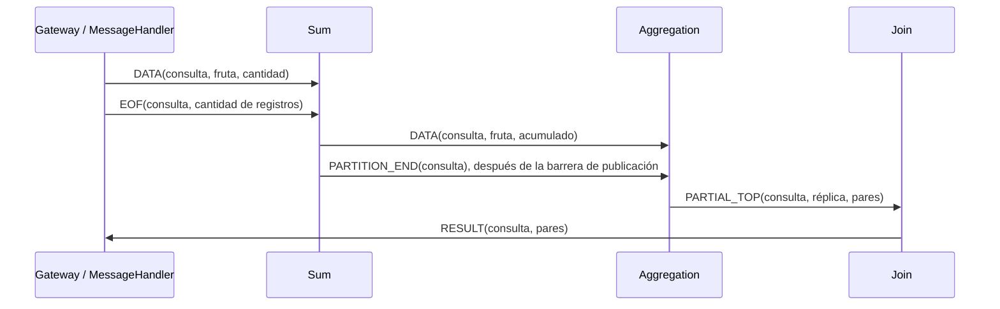
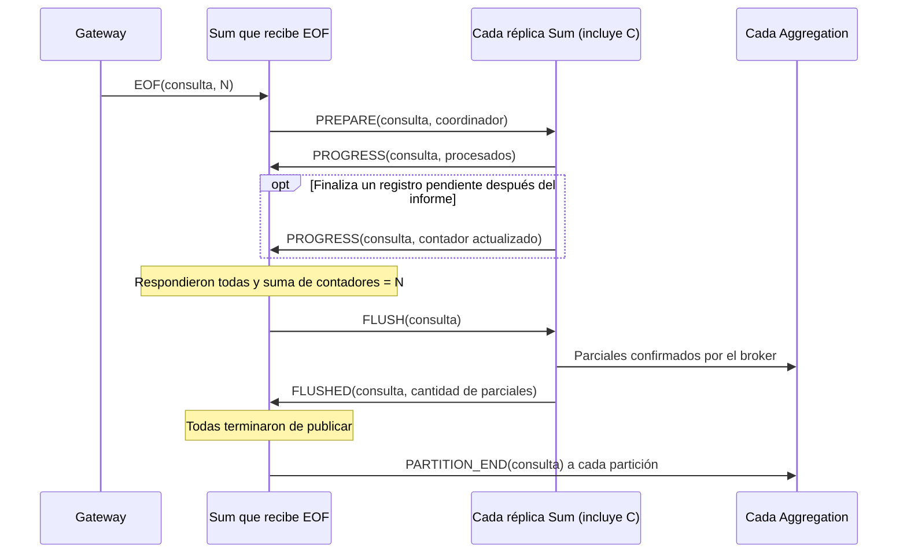

Redactar un breve informe en el archivo `INFORME.md` explicando el modo en que se coordinan las instancias de Sum y Aggregation, así como el modo en el que el sistema escala respecto a los clientes, grándes volúmens de datos y la cantidad de controles.

## Middleware (implementado)

Se conserva la interfaz provista y se agregan dos métodos a las implementaciones
RabbitMQ:

- `send_to_queue(queue_name, message)` declara una cola durable antes de la
  primera publicación a ese destino y reutiliza la conexión existente. Espera
  confirmación del broker y detecta publicaciones sin destino mediante
  `mandatory=True`. El método `send(message)` de la implementación de colas usa
  este mismo mecanismo.
- `register_consumer(queue_name, callback)` declara una cola adicional y guarda
  su callback. Se invoca antes de `start_consuming(callback_principal)`, que
  atiende todos los consumidores secuencialmente. `stop_consuming()` los detiene
  a todos; las registraciones se conservan para un nuevo inicio.

Cada consumidor tiene prefetch de un mensaje y acknowledgements manuales. La
conexión pertenece al proceso que crea el middleware; no se comparte entre
procesos ni requiere threads para atender varias colas. Los callbacks deben
evitar trabajos prolongados que impidan atender los eventos de la conexión.

Las publicaciones usan publisher confirms. Una confirmación significa que el
broker aceptó el mensaje, no que el consumidor terminó de procesarlo. La clase
de exchanges conserva sus suscripciones temporales y no exige destinatarios
para su método `send`.

Ante errores de comunicación, el middleware intenta cerrar su conexión y
propaga el error. No se implementan reconexiones ni reintentos automáticos.

## Aislamiento de consultas y flujo de datos

Cada `MessageHandler` crea un identificador de consulta antes de que el Gateway
lo copie a sus procesos. Los mensajes internos incluyen ese identificador y un
tipo explícito: datos, fin de registros, cierre de partición, top parcial o
resultado final. El EOF
del Gateway lleva la cantidad de registros enviados. El handler de respuesta
solo devuelve los resultados de su propia consulta; devuelve `None` para las
ajenas. Para un top vacío coincidente devuelve una lista con valor booleano
verdadero, porque el Gateway fijo usa esa condición para decidir si encontró al
destinatario, mientras que el protocolo externo usa la longitud de la lista.

El diagrama resume una consulta; mensajes de consultas distintas pueden
intercalarse. Sum y Aggregation mantienen acumulados y contadores separados por
consulta. Sum verifica entre sus réplicas el total de registros de esa consulta
anunciado en el EOF antes de publicar los
parciales. Cada Aggregation finaliza al recibir el marcador PARTITION_END,
publicado después de que todas las Sum confirmaron sus envíos. Los parciales y
su marcador viajan por la misma cola de Aggregation, declarada antes de enviar.
Cada proceso reutiliza su conexión para consumir y publicar.

La acumulación utiliza `FruitItem.__add__`. Aggregation selecciona los mayores
elementos recién después de consolidar las cantidades, usando las comparaciones
de `FruitItem`. Join identifica los emisores de cada top y conserva como máximo
`TOP_SIZE` candidatos entre recepciones. El estado de una consulta se elimina
después de confirmar la publicación de su salida.

La lógica común de acumulación y selección está en `common/processing.py`; el
consumo, cierre y manejo de SIGTERM/SIGINT están en `common/control.py`. Los
callbacks se ejecutan secuencialmente en el proceso propietario del estado, por
lo que no hay actualizaciones concurrentes que requieran un mutex local. Ante
errores se registra la causa, se cierran los recursos y el control termina con
código distinto de cero.

## Coordinación de las réplicas de Sum

Las réplicas consumen datos de la misma cola de entrada. Cada una mantiene sus
acumulados por consulta y atiende además una cola de control cuyo nombre se
deriva de `SUM_PREFIX` e `ID`. No se crean colas por cliente. La réplica que
recibe el EOF del Gateway coordina exclusivamente el cierre de esa consulta;
también sigue participando como trabajadora.

El cierre tiene dos barreras:

1. **Procesamiento:** el coordinador envía `PREPARE` a todas las Sum. Cada una
   responde con `PROGRESS`, incluyendo su contador acumulado de registros
   procesados, incluso si es cero. Si termina un registro después de responder,
   envía el contador actualizado. El coordinador espera informes de todas las
   réplicas y una suma exactamente igual al total anunciado por el Gateway.
2. **Publicación:** el coordinador envía `FLUSH`. Cada réplica publica sus
   parciales hacia Aggregation y, una vez confirmados por RabbitMQ, responde
   `FLUSHED` con la cantidad de parciales. Solo cuando respondieron todas se
   publica un marcador PARTITION_END hacia cada Aggregation, incluso si su
   partición no recibió datos.

Se trata de un protocolo de finalización con dos barreras. Si una réplica falla después de publicar algunos parciales, no se revierten esas publicaciones ni se garantiza completar la consulta.

Las barreras coordinan procesos independientes mediante RabbitMQ.
`CompletionBarrier` es el estado local que el coordinador utiliza para registrar
los informes y comprobar las condiciones de avance. El protocolo actual permite
seguir atendiendo mensajes mientras se esperan respuestas de otras réplicas.

La primera barrera no supone orden entre la cola de control y la de datos. La
prueba de finalización se basa en los contadores. Para acotar el tráfico se usa
que cada Gateway publica sus registros y EOF por el mismo canal y cola, sin
prioridades, y cada consumidor de datos tiene prefetch 1 y confirma después de
procesar. Al extraerse el EOF, los registros anteriores ya fueron entregados;
queda a lo sumo uno pendiente por réplica. Por eso, después de `PREPARE`, cada
réplica necesita un informe inicial y como máximo una actualización. Este
argumento corresponde a ejecución sin fallas ni reentregas: no se implementa
recuperación después de una desconexión.

En la segunda barrera, las confirmaciones del broker establecen que todos los
parciales llegaron a sus colas antes de publicar los marcadores. Cada Aggregation
tiene un único consumidor secuencial y recibe el marcador por su cola de datos, por lo que
no calcula el top mientras queden parciales anteriores por procesar.

Con S réplicas Sum y A Aggregation, el cierre requiere a lo sumo `5*S + A` publicaciones de control
internas por consulta: preparación, hasta dos informes de progreso, orden de
publicación, confirmación de publicación y un marcador por Aggregation. Se
excluyen el EOF original y los acknowledgements del transporte. Los mensajes
llevan identificadores y contadores, no listas de registros ni de réplicas. El
coordinador mantiene O(S) estado y actualiza los totales incrementalmente, sin
recorrer todos los contadores en cada informe. Los contadores requieren una
cantidad de dígitos proporcional al logaritmo del volumen representado.

No se espera bloqueando dentro de un callback a que otras réplicas respondan.
Cada mensaje actualiza el estado y retorna al consumo. Los datos de consultas
distintas pueden seguir intercalándose. El estado local se elimina después de
publicar `FLUSHED`, y el de coordinación después de publicar todos los marcadores.

## Particionado entre Aggregation y top final de la consulta

Cada Sum calcula `SHA-256(fruta en UTF-8) % AGGREGATION_AMOUNT` y publica el
parcial únicamente en la cola de ese destino. La función está en
`common/partitioning.py` y produce el mismo resultado en todos los procesos;
no usa el `hash()` de strings de Python, que puede variar entre intérpretes.
No se depende de nombres de contenedores ni de un número fijo de réplicas.
Las colas se derivan de los prefijos e identificadores configurados.

Los parciales de una misma fruta y consulta siempre llegan al mismo Aggregation,
que consolida su total antes de calcular el top. Así se elimina el procesamiento
redundante del broadcast de datos del esqueleto. Todas las particiones pueden
recibir trabajo; el balance depende de las frutas presentes y su distribución.
Con pocas frutas distintas puede haber particiones vacías, y una fruta muy
frecuente no se reparte entre varias Aggregation.

El EOF del Gateway sigue llevando el número de registros originales. El cierre
de una partición, en cambio, usa PARTITION_END sin un contador local: su validez
proviene de la barrera de publicaciones confirmadas y del orden de la cola, no
solo de haber recibido un mensaje de control. Esto evita transmitir desde cada
Sum un vector de contadores por Aggregation, que requeriría O(S*A) valores. La
cantidad total de parciales de cada consulta informada por FLUSHED se conserva
para diagnóstico.

Una partición vacía recibe igualmente PARTITION_END y envía un top vacío. Join
espera un top por identificador de Aggregation, conserva a lo sumo TOP_SIZE
candidatos entre recepciones y emite un resultado final por consulta. Una fruta
que no está en el top de su partición tampoco puede entrar en el top final de
esa consulta:
ya existen TOP_SIZE frutas de esa partición que la preceden según el orden de
FruitItem. Esta propiedad depende de que cada fruta tenga un único dueño.

La combinación de tops parciales se realiza por `query_id`: los candidatos de
consultas diferentes nunca se mezclan. Cada cliente recibe el top final de su
propia consulta.

Con K = TOP_SIZE, Aggregation envía como máximo A*K candidatos a Join por
consulta. El estado de Join es O(K+A), incluyendo el conjunto de emisores; el
control del cierre entre Sum y Aggregation es O(S+A). No se crean conexiones por
cada pareja de réplicas: las publicaciones reutilizan la conexión del proceso.
