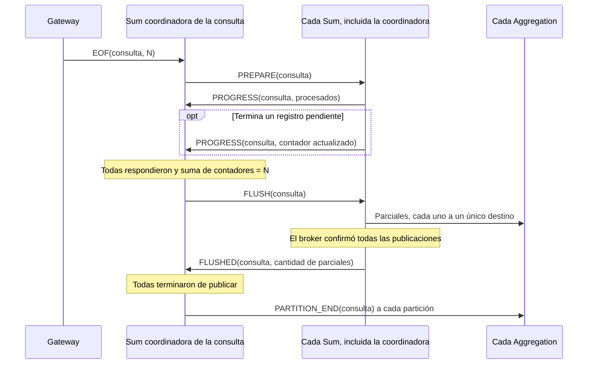
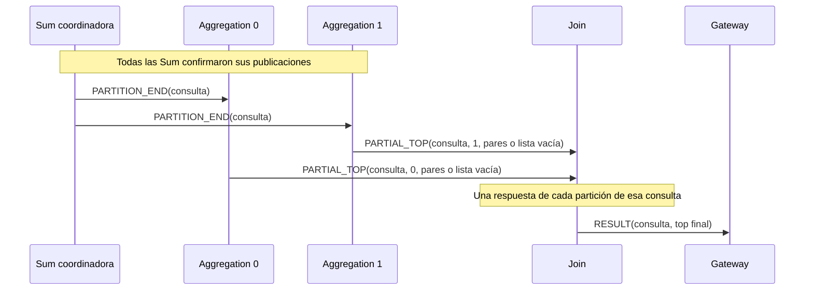

# Informe — Coordinación

## 1. Arquitectura y aislamiento de consultas

La solución en Python conserva el recorrido Gateway → Sum → Aggregation → Join
→ Gateway. Cada réplica corre en un proceso independiente. Los controles usan
RabbitMQ para intercambiar datos y coordinar su finalización.

`MessageHandler` crea un `query_id` antes de que el Gateway lo copie a sus
procesos. Ese identificador acompaña todos los mensajes internos. Sum y
Aggregation separan los acumulados por consulta; Join separa sus candidatos y
emisores de tops. El Gateway entrega únicamente el resultado que corresponde
al identificador de su handler. Cada cliente recibe el **top final de su propia
consulta**, sin combinar datos de otros clientes.

El protocolo externo y el cliente permanecen intactos. Internamente se usan
mensajes con tipos explícitos y campos validados. El EOF del Gateway incluye la
cantidad de registros originales. Para distinguir un resultado vacío válido de
uno ajeno, el handler devuelve una lista cuyo valor booleano es verdadero en el
primer caso y `None` en el segundo, respetando la selección del Gateway fijo.

## 2. Coordinación de las instancias de Sum

Todas las Sum compiten por mensajes de la cola compartida de entrada. Cada una
acumula por fruta y consulta usando `FruitItem.__add__`, cuenta los registros
procesados y hace ack después de actualizar el estado. No se asigna un cliente
entero a una sola réplica: incluso una única consulta puede utilizar varias Sum.

Cada réplica atiende además una cola de control derivada de `SUM_PREFIX` e `ID`.
La Sum que recibe el EOF coordina el cierre de esa consulta y continúa
participando como trabajadora. `CompletionBarrier` mantiene localmente los
informes recibidos; las réplicas se sincronizan mediante mensajes, sin compartir
un objeto de memoria entre contenedores.

El protocolo establece dos barreras:

1. **Procesamiento:** el coordinador envía `PREPARE` a todas las Sum, incluida
   él mismo. Cada réplica responde `PROGRESS` con su contador acumulado, incluso
   si vale cero. Si termina un registro pendiente después del informe, envía el
   contador actualizado. Se avanza cuando respondieron todas y la suma de sus
   contadores coincide exactamente con el total del EOF.
2. **Publicación:** el coordinador envía `FLUSH`. Cada Sum publica sus parciales
   hacia las particiones correspondientes y espera las confirmaciones del broker.
   Después responde `FLUSHED`. Una vez recibidas todas esas respuestas, el
   coordinador publica `PARTITION_END` en cada cola de Aggregation.

La primera barrera no presupone orden entre las colas de datos y control. Para
acotar los informes se aprovecha que cada Gateway publica sus datos y EOF por
el mismo canal y cola, sin prioridades, y cada consumidor tiene prefetch 1.
Cuando se extrae el EOF, los registros anteriores ya fueron entregados y queda
como máximo uno pendiente por consumidor de datos. Cada Sum necesita entonces
un informe inicial y como máximo una actualización. Este razonamiento supone
la ejecución sin fallas ni reentregas.

Los informes actualizan el total por diferencia, sin recorrer todas las réplicas
en cada recepción. Los callbacks no esperan bloqueando las respuestas de otros
procesos: actualizan el estado y retornan al consumo. El estado local se libera
tras confirmar `FLUSHED`, y el del coordinador tras publicar los marcadores.

## 3. Coordinación de las instancias de Aggregation y Join

### 3.1. Distribución de responsabilidades

Cada Sum calcula `SHA-256(fruta en UTF-8) % AGGREGATION_AMOUNT` y publica el
parcial en la cola de ese destino. La función es estable entre procesos; no se
usa el `hash()` de strings de Python. Todos los parciales de una fruta y consulta
llegan a un único Aggregation, evitando el broadcast de datos.
Los nombres de colas se derivan de los prefijos e identificadores configurados.

Las Aggregation no necesitan intercambiar mensajes entre sí: cada una es
responsable de una partición disjunta de frutas. Su coordinación se establece
con el cierre de los productores Sum y la reunión de respuestas en Join.

### 3.2. Detección de finalización de cada partición

Un Aggregation termina una consulta al consumir `PARTITION_END`. El marcador
viaja por la misma cola que sus datos y se publica únicamente después de que
todas las Sum confirmaron sus publicaciones. Cada partición tiene un consumidor
secuencial: al procesar el marcador ya procesó todos los parciales anteriores.
No se utilizan timeouts ni el estado aparentemente vacío de una cola para
inferir que terminó la consulta.

Esta garantía reemplaza un contador de parciales por partición. Enviar un vector
de contadores desde cada Sum requeriría hasta S*A valores; el protocolo conserva
solo un contador total de parciales por Sum para diagnóstico. Una partición sin
datos también recibe el marcador y publica un top vacío.

### 3.3. Reunión del top final de la consulta

Cada Aggregation selecciona hasta `TOP_SIZE` frutas después de consolidarlas,
utilizando las comparaciones de `FruitItem`. Envía un `PARTIAL_TOP` con el
identificador de consulta y de réplica. Join espera una respuesta de cada
Aggregation, rechaza emisores inválidos o repetidos y mantiene como candidatos
solo los mejores `TOP_SIZE` elementos recibidos. Después publica un único
`RESULT` para esa consulta y libera su estado.

El diagrama ilustra dos particiones; el algoritmo usa la cantidad configurada.
La unión de tops es suficiente porque cada fruta tiene un único dueño: si queda
fuera del top de su partición, ya existen `TOP_SIZE` frutas que la preceden y
no puede entrar en el top final de esa consulta. Los candidatos de consultas
distintas nunca se mezclan.

## 4. Escalabilidad

Se usan C para consultas activas, S para réplicas Sum, A para Aggregation,
N para registros de una consulta, F para sus frutas distintas y K para
`TOP_SIZE`. Las cotas de estado cuentan elementos, no bytes de longitud fija.

### 4.1. Cantidad de clientes

Los mensajes de consultas diferentes pueden intercalarse sin mezclar su estado.
Las colas de procesamiento y control se reutilizan: su cantidad no crece por
cliente. El estado de los controles sí crece con las consultas activas y se
elimina cuando cada etapa confirma su salida. Si todas las consultas tuvieran
el mismo tamaño, las cotas por consulta indicadas abajo se multiplicarían por C.

El Gateway provisto tiene un pool finito de procesos, un consumidor de respuestas
y una búsqueda del destinatario recorriendo la lista de clientes. Además espera
el ACK del cliente antes de seguir entregando resultados. Esas características
limitan la admisión y entrega concurrente; agregar Sum o Aggregation no elimina
esos límites del componente fijo. El sistema no garantiza capacidad ilimitada
al aumentar la cantidad de clientes.

### 4.2. Grandes volúmenes de datos

El cliente lee el archivo por registros y los controles procesan mensajes
incrementalmente. Sum conserva acumulados por fruta, sin guardar todos los
registros recibidos. Si aumenta N manteniendo F fijo, aumenta el trabajo pero
no proporcionalmente la cantidad de entradas de los acumulados. Entre Sum y
Aggregation se envía un parcial por fruta presente en cada Sum: como máximo
`min(N, S*F)` parciales por consulta. Join recibe hasta A*K candidatos.

| Estado por consulta | Cantidad de elementos en la implementación actual |
|---|---|
| Acumulados de todas las Sum | Hasta `min(N, S*F)` entradas de fruta |
| Acumulados de todas las Aggregation | Hasta F entradas de fruta |
| Barrera en la Sum coordinadora | O(S) |
| Candidatos y emisores de Join | O(K+A) |

El prefetch limita los mensajes entregados pendientes de ack, pero no limita
los acumulados ni los mensajes que pueden esperar en el broker. Actualmente,
si crecen F o C, los diccionarios en memoria también crecen; **todavía no hay un
límite de memoria independiente de esos tamaños**.

Además, `_flush()` publica todos los acumulados de una consulta dentro de un
callback, y la selección del top recorre sus frutas. Con muchos elementos estas
tareas pueden demorar la atención de otras consultas y de eventos de conexión.
Quedan pendientes almacenamiento de acumulados con memoria acotada y ejecución
por porciones de las tareas extensas. Son cambios necesarios para completar
este aspecto de la solución; el paso de los escenarios pequeños no lo demuestra.

### 4.3. Cantidad de controles

Las Sum comparten trabajo como consumidores competidores. Las Aggregation
reparten las frutas por hash. No se reserva una réplica para cada cliente y no
se duplica cada parcial en todas las Aggregation. No obstante, pocas frutas o
una distribución desigual pueden dejar particiones vacías o desbalanceadas;
una misma fruta no se reparte entre Aggregation distintas. Aumentar S también
puede aumentar la cantidad de parciales que Aggregation debe consolidar.

El cierre requiere como máximo `5*S + A` publicaciones internas de control por
consulta: S preparaciones, hasta 2*S informes, S órdenes de publicación,
S respuestas y A marcadores. Se excluyen el EOF original, los tops parciales y
los acknowledgements del transporte. Los mensajes llevan identificadores y
contadores, sin listas de registros ni vectores por cada pareja de réplicas.
El número de dígitos de los contadores crece con el volumen representado.

Las colas propias del procesamiento y control son O(S+A), y cada proceso
reutiliza su conexión para consumir y publicar. No hay una conexión por pareja
Sum-Aggregation. Join recibe O(A*K) candidatos por consulta, pero conserva solo
O(K+A) estado. La cola de entrada compartida, RabbitMQ, el Gateway y el único
Join siguen siendo puntos de capacidad finita: la escalabilidad no implica una
mejora lineal garantizada al agregar réplicas.

## 5. Middleware, recursos y alcance de fallas

Se conserva la interfaz del middleware y se agregan `send_to_queue()` para
declarar destinos durables y publicar con confirmación, y `register_consumer()`
para atender datos y control con la misma conexión. La publicación a colas usa
`mandatory=True`; una confirmación acredita aceptación por el broker, no
procesamiento por el destinatario. Los callbacks se ejecutan secuencialmente
en el proceso dueño del estado, sin acceso concurrente que requiera mutex local.

La lógica común está en `common/processing.py` y `common/control.py`; las clases
base declaran explícitamente sus métodos abstractos. Sum, Aggregation y Join
manejan SIGTERM/SIGINT, cierran sus recursos y registran los errores. Ante una
falla de comunicación se intenta cerrar y se propaga el error, sin reconexiones
ni reintentos automáticos. No se garantiza completar ni revertir una consulta
interrumpida.
