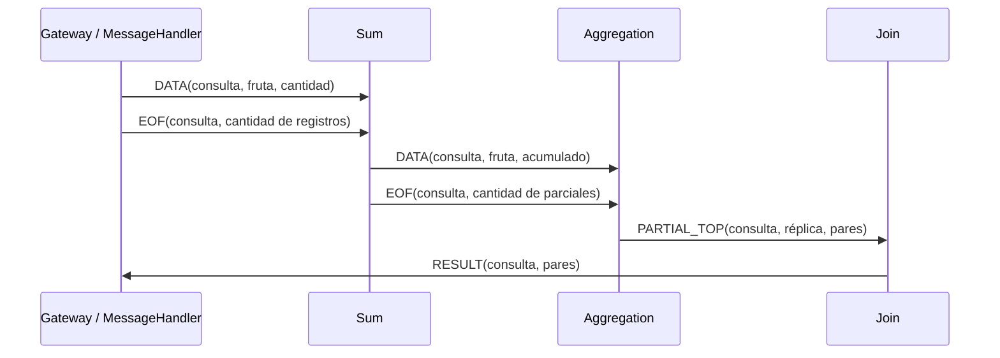

Redactar un breve informe en el archivo `INFORME.md` explicando el modo en que se coordinan las instancias de Sum y Aggregation, así como el modo en el que el sistema escala respecto a los clientes, grándes volúmens de datos y la cantidad de controles.

## Middleware (implementado)

Se conserva la interfaz provista y se agregan dos métodos a las implementaciones
RabbitMQ:

- `send_to_queue(queue_name, message)` declara una cola durable antes de la
  primera publicación a ese destino y reutiliza la conexión existente. Espera
  confirmación del broker y detecta publicaciones sin destino mediante
  `mandatory=True`. El método `send(message)` de la implementación de colas usa
  este mismo mecanismo.
- `register_consumer(queue_name, callback)` declara una cola adicional y guarda
  su callback. Se invoca antes de `start_consuming(callback_principal)`, que
  atiende todos los consumidores secuencialmente. `stop_consuming()` los detiene
  a todos; las registraciones se conservan para un nuevo inicio.

Cada consumidor tiene prefetch de un mensaje y acknowledgements manuales. La
conexión pertenece al proceso que crea el middleware; no se comparte entre
procesos ni requiere threads para atender varias colas. Los callbacks deben
evitar trabajos prolongados que impidan atender los eventos de la conexión.

Las publicaciones usan publisher confirms. Una confirmación significa que el
broker aceptó el mensaje, no que el consumidor terminó de procesarlo. La clase
de exchanges conserva sus suscripciones temporales y no exige destinatarios
para su método `send`.

Ante errores de comunicación, el middleware intenta cerrar su conexión y
propaga el error. No se implementan reconexiones ni reintentos automáticos.

## Aislamiento de consultas y flujo con una réplica

Cada `MessageHandler` crea un identificador de consulta antes de que el Gateway
lo copie a sus procesos. Los mensajes internos incluyen ese identificador y un
tipo explícito: datos, fin de registros, top parcial o resultado final. El EOF
del Gateway lleva la cantidad de registros enviados. El handler de respuesta
solo devuelve los resultados de su propia consulta; devuelve `None` para las
ajenas. Para un top vacío coincidente devuelve una lista con valor booleano
verdadero, porque el Gateway fijo usa esa condición para decidir si encontró al
destinatario, mientras que el protocolo externo usa la longitud de la lista.

El diagrama resume una consulta; mensajes de consultas distintas pueden
intercalarse. Sum y Aggregation mantienen acumulados y contadores separados por
consulta. Con una réplica por etapa, cada EOF se procesa después de los datos de
su consulta y se verifica su contador antes de publicar la salida. Los parciales
y su marcador viajan por la misma cola de Aggregation, declarada antes de enviar.
Cada proceso reutiliza su conexión para consumir y publicar.

La acumulación utiliza `FruitItem.__add__`. Aggregation selecciona los mayores
elementos recién después de consolidar las cantidades, usando las comparaciones
de `FruitItem`. Join identifica los emisores de cada top y conserva como máximo
`TOP_SIZE` candidatos entre recepciones. El estado de una consulta se elimina
después de confirmar la publicación de su salida.

La lógica común de acumulación y selección está en `common/processing.py`; el
consumo, cierre y manejo de SIGTERM/SIGINT están en `common/control.py`. Los
callbacks se ejecutan secuencialmente en el proceso propietario del estado, por
lo que no hay actualizaciones concurrentes que requieran un mutex local. Ante
errores se registra la causa, se cierran los recursos y el control termina con
código distinto de cero.
